# 多台虚拟机构成完全分布式集群


## 相关软件准备

- VMware Workstation Pro
- Centos镜像：CentOS-7-x86_64-Everything-1908.iso
- SSH终端工具：MobaXterm

## 配置

### NAT子网配置

#### 虚拟机网络连接方式

- 桥接模式：IP与主机完全相同，相当于用一条网线直接连接在一起

- NAT模式：相当于以自己PC形成的一个局域网，虚拟机和主机都有自己对应的局域网IP
- 仅主机模式：虚拟机只能访问主机

#### 配置NAT子网

需要配置NAT模式下的子网地址（配置需要管理权限），也可以保留初始设置

局域网可使用的网段（私网地址段）有三大段：
				10.0.0.0~10.255.255.255（A类）
				172.16.0.0~172.31.255.255（B类）
				192.168.0.0~192.168.255.255（C类）

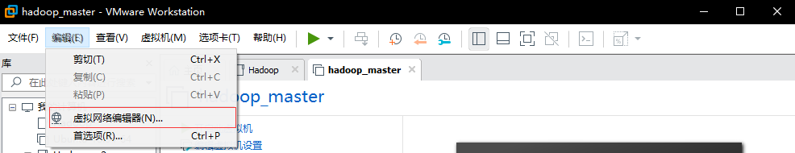

1. 子网设置为：192.168.45.0

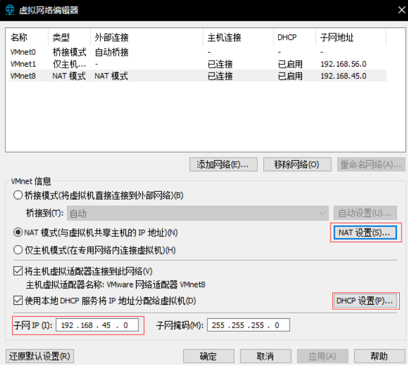

2. 网关设置为192.168.45.1


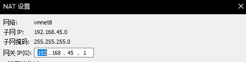

3. DHCP设置中起始地址，结束地址设置如下


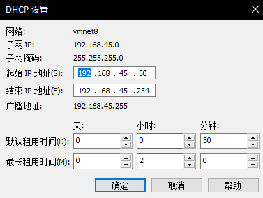

4. 以上步骤完成后配置本机NAT连接下的IPｖ４。仅需配置其中的VMnet8

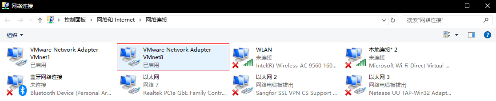

5. 双击VMnet8，点击属性，选择IPv4协议。具体配置如下

   `注意`IP地址尽量不与DHCP配置的区间重复。

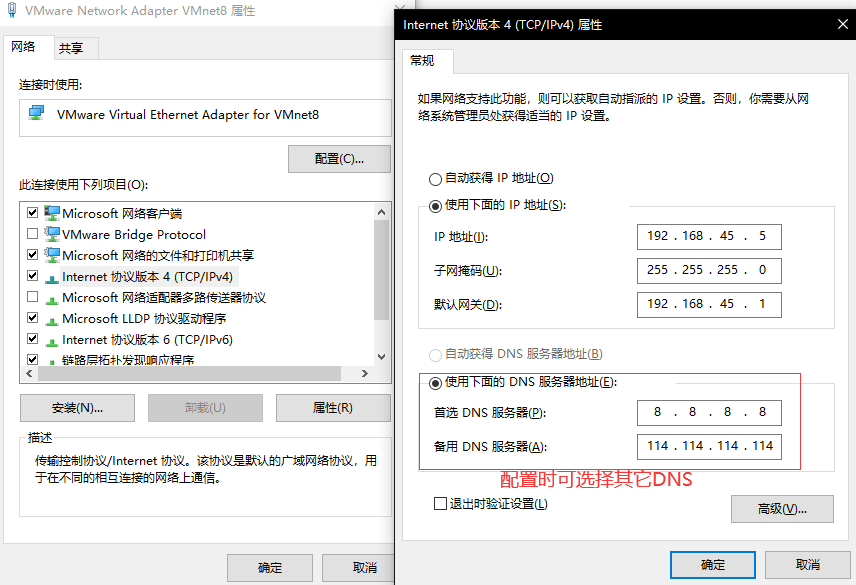

### CentOS-7虚拟机的安装

按照基本步骤安装即可，不太熟悉命令行的同学可以使用最小化安装。此处为保证通用性，采用

最小化安装，仅勾选一个兼容性程序库

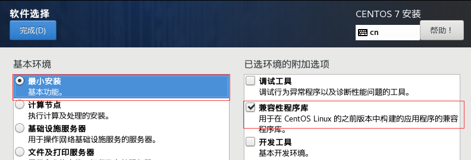

在虚拟安装过程中创建一个用户，名为`hadoop`，有管理员权限。（若此处没有创建，在后续步骤也可以创建）

### CentOS-7虚拟机的配置

#### hadoop用户授权

以root用户登入，键入

```cmd
visudo
```

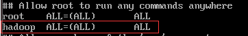

赋予hadoop等同于root用户的权限

此后的操作都在hadoop用户下运行

```cmd
su hadoop #su 用户名  可以更换用户
```

#### 更换软件源

#### 修改ens33文件

当前NAT子网下的网络还连不了网

```cmd
sudo vi /etc/sysconfig/network-scripts/ifcfg-ens33
```

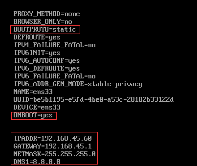

`注意：`中间需要空两行

#### 更换软件源

1. 先安装wget用于下阿里源文件

   ```cmd
   sudo yum install wget
   ```

2. 先拷贝源文件

   ```
   sudo mv /etc/yum.repos.d/CentOS-Base.repo /etc/yum.repos.d/CentOS-Base.repo.bak
   ```

3. 下载阿里源文件

   ```cmd
   sudo wget -O /etc/yum.repos.d/CentOS-Base.repo http://mirrors.aliyun.com/repo/Centos-7.repo
   ```

4. 换源后刷新下yum库

   ```cmd
   yum clean all
   yum makecache
   ```

#### 安装GNOME桌面（可选）

安装GNOME界面

```cmd
sudo yum groupintsall "GOME Desktop"
```

用命令启动GNOME

```cmd
startx
```

建议同时安装粘贴板共享软件

```cmd
sudo yum install open-vm-tools
```

#### 安装相关软件

1. 安装ifconfig便于查看IP地址等信息

```cmd
sudo yum install ifconfig
```

2. 假如没有相关的安装包

```cmd
yum search ifconfig
```

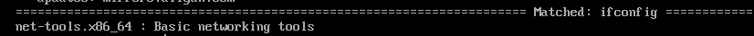

3. 找到安装包安装

```cmd
sudo yum install net-tools.x86_64
```

4. 为了之后用MobaXtermd的SSH连接，我们查询IP地址

```cmd
ifconfig
```

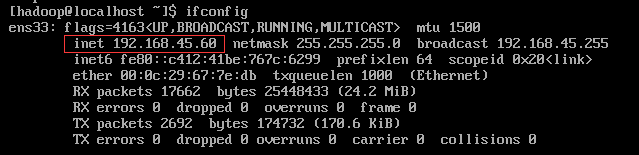

这个IP就是ens33文件配置的IPADDR

安装VIM便于文件编辑

```cmd
sudo yum install vim
```

#### 用MobaXterm的SSH登录

1. 选择Session，配置如下


2.输入密码即可登录

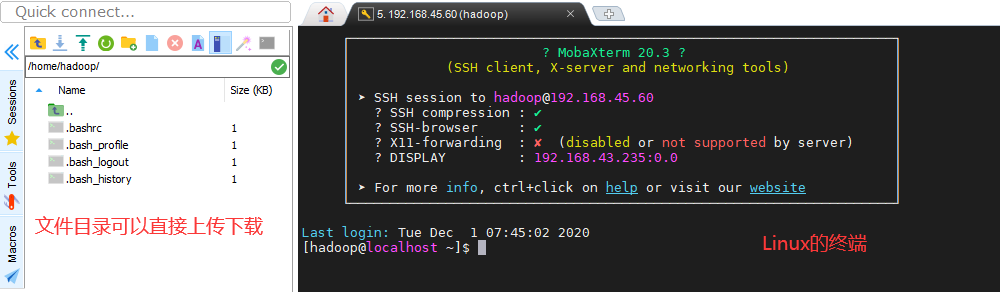

##### 

#### 更改hostname和hosts

在该集群中有三台主机，一台为master，两台slave

设计这几台的IP地址为

| 主机    | IP地址        |
| ------- | ------------- |
| master  | 192.168.45.60 |
| slave01 | 192.168.45.70 |
| slave02 | 192.168.45.80 |

1. hostname存储的是主机名

   修改`/etc/hostname`文件

   ```cmd
   sudo vi /etc/hostname
   ```

   该主机配置为master，但是该虚拟机今后将复制注意更改

2. hosts作用是对外访问时，用主机名代替IP地址访问其他主机

   修改`/etc/hosts`文件

   ```cmd
   sudo vi /etc/hosts
   ```

   文件配置如下

   ```cmd
   192.168.45.60 master
   192.168.45.70 slave01
   192.168.45.80 slave02
   ```

3. 最后重启来使新的主机名应用

   ```cmd
   sudo reboot
   ```

   主机名更换表示hostname文件配置成功

   

#### 关闭防火墙

在Spark和Hadoop的许多端口需要开放以保证正常使用，云服务器假如端口开放过多会导致木马蠕虫等问题，但是对于虚拟机我们采用直接关闭防火墙的方案。当然也可以在今后出现问题的时候再开放防火墙。

```cmd
systemctl status firewalld.service	#查看防火墙状态
```

开启的情况

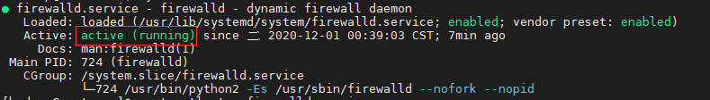

关闭的情况

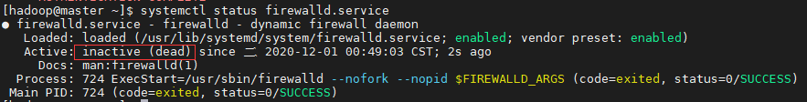

```cmd
systemctl stop firewalld.service	#关闭防火墙
```

```cmd
systemctl disable firewalld.service	#重启后依旧关闭防火墙
```

永久关闭后

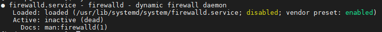

#### SSH

##### SSH原理

SSH采用的非对称式加密（公钥加密），telnet和FTP采用的是对称式加密（密钥加密）

- 对称式加密式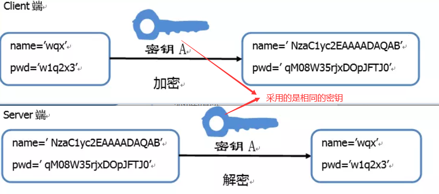
- 非对称式加密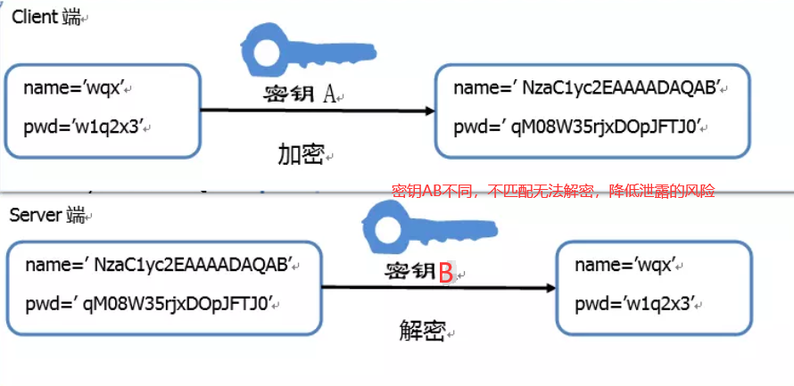


##### SSH的安装配置

centos7默认安装openssh, 6以及之前的版本需要自行安装

```cmd
sudo yum install open-ssh
```

由于生成的密钥有后缀“用户@主机”所以先设置主机名较好，但是后设置不影响应用。

```cmd
sudo vim /etc/hostname 
```

删除原有用户名，设置为masterXX或是slavesXX。（要更新需要）

```cmd
sudo reboot
```

1. 生成密钥（在hadoop用户下生成）

   ```
   ssh localhost 	#生成文件夹
   cd ~/.ssh		
   ssh-keygen -t rsa#生成公钥和密钥
   ```

   三个回车就直接生成在当前文件夹下

2. 将密钥加入授权，SSH通过检测公钥来个

   ```cmd
   cat id_rsa.pub >> authorized_keys
   ```

   此时还达不到免密登录的要求

   ```cmd
   ssh localhost #还需要密码
   ```

   赋予改文件的权限600

   ```cmd
   chmod 600 ./authorized_keys
   ```

   ```cmd
   ssh localhost	#测试是否可以免密登录
   ```

   这时可以免密登录，SSH配置完成

#### 安装Java，python

```
sudo yum install java-1.8.0-openjdk java-1.8.0-openjdk-devel  
```

配置环境变量

```
vim ~/.bashrc
```

在末尾添加路径

```cmd
export JAVA_HOME=/usr/lib/jvm/java-1.8.0-openjdk
```

载入刚才对bashrc文件的更改

```cmd
source ~/.bashrc
```

可以查看Java版本来测试对环境变量是否成功添加

```
java -version
```

查看python3的版本

```
yum list python3
```

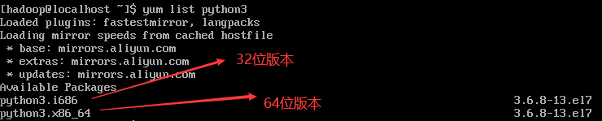

根据需求安装所需版本

此处实验安装python3.x86_64

```cmd
sudo yum install python3.x86_64
```

### 安装配置Hadoop,Spark

#### 安装

##### 下载hadoop，spark可到虚拟机

Hadoop版本：2.8.5

Spark版本：2.4.7

1. 直接下载到虚拟机

```cmd
sudo wget -O ~/hadoop-2.8.5.tar.gz https://archive.apache.org/dist/hadoop/common/hadoop-2.8.5/hadoop-2.8.5.tar.gz

sudo wget -O ~/spark-2.4.7-bin-without-hadoop.tgz https://mirrors.tuna.tsinghua.edu.cn/apache/spark/spark-2.4.7/spark-2.4.7-bin-without-hadoop.tgz  
```


2. 下载到主机，再通过共享文件夹，scp传输等供虚拟机使用。

window环境下推荐使用（直接拖拽上传），本教程也采用这种方案，将文件上传至`~/`目录下

##### 

##### 安装Hadoop

```cmd
sudo tar -zxf hadoop-2.8.5.tar.gz -C /usr/local/	#解压
sudo mv /usr/local/hadoop-2.8.5/ /usr/local/hadoop	#重命名
sudo chown -R hadoop:hadoop /usr/local/hadoop/		#授权
```

```cmd
/usr/local/hadoop/bin/hadoop version		#测试是否安装成功
```

##### 安装Spark


```cmd
sudo tar -zxf spark-2.4.7-bin-without-hadoop.tgz -C /usr/local/	#解压
sudo mv /usr/local/spark-2.4.7-bin-without-hadoop/ /usr/local/spark	#重命名
sudo chown -R hadoop:hadoop /usr/local/spark/		#授权
```

配置spark环境

```cmd
cp /usr/local/spark/conf/spark-env.sh.template /usr/local/spark/conf/spark-env.sh#拷贝
vim /usr/local/spark/conf/spark-env.sh
```

在文件第一行添加

```cmd
export SPARK_DIST_CLASSPATH=$(/usr/local/hadoop/bin/hadoop classpath)
```

配置系统环境

```cmd
vim ~/.bashrc
```

在文件末尾添加

```
export JAVA_HOME=/usr/lib/jvm/java-1.8.0-openjdk # 之前配置的java环境变量
export HADOOP_HOME=/usr/local/hadoop # hadoop安装位置
export SPARK_HOME=/usr/local/spark
export PYTHONPATH=$SPARK_HOME/python:$SPARK_HOME/python/lib/py4j-0.10.7-
src.zip:$PYTHONPATH
export PYSPARK_PYTHON=python3 # 设置pyspark运行的python版本
export PATH=$HADOOP_HOME/bin:$SPARK_HOME/bin:$PATH
```

```cmd
source ~/.bashrc #使.bashrc文件生效
/usr/local/spark/bin/run-example SparkPi	#假如输出一堆则成功
```

启动pyspark

```
/usr/local/spark/bin/pyspark
```

出现如下则成功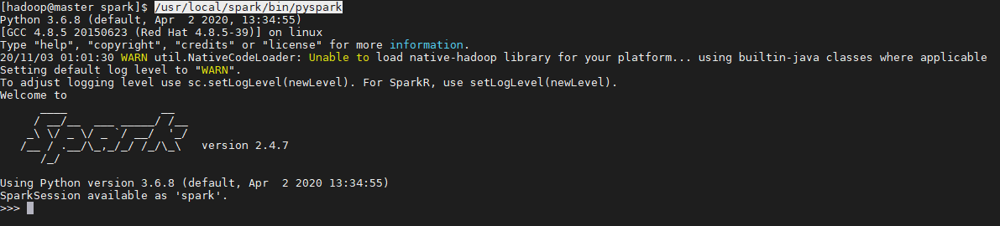

#### 配置

##### 配置Hadoop


1. 修改slaves文件

```cmd
cd /usr/local/hadoop/etc/hadoop
vim slaves
```

文件内容为

```cmd
slave01
slave02
```

2. 修改文件 core-site.xml文件

```cmd
vim core-site.xml
```

```cmd
<configuration>
	<property>
		<name>hadoop.tmp.dir</name>
		<value>/usr/local/hadoop/tmp</value>
		<description>Abase for other temporary directories.</description>
	</property>
	<property>
		<name>fs.defaultFS</name>
		<value>hdfs://master:9000</value>
	</property>
</configuration>
```

3. 修改 hdfs-site.xml   (其中的dfs.permissions在hdfs.client中使用使要设置为false)

```cmd
vim hdfs-site.xml
```

```
<configuration>
	<property>
		<name>dfs.replication</name>
		<value>3</value>
	</property>
	<property>
		<name>mapred.job.tracker</name>
		<value>master:9001</value>
	</property>
	<property>
		<name>dfs.namenode.http-address</name>
		<value>master:50070</value>
	</property>
	<property>
		<name>dfs.permissions</name>
		<value>false</value>
	</property>
</configuration>
```

4. 拷贝mapred-site.xml.template文件为mapred-site.xml,并修改

  

```
cp mapred-site.xml.template mapred-site.xml
vim mapred-site.xml
```

```cmd
<configuration>
	<property>
		<name>mapreduce.framework.name</name>
		<value>yarn</value>
	</property>
</configuration>
```

5. 修改 yarn-site.xml  

```cmd
vim yarn-site.xml
```

```cmd
<configuration>
<!-- Site specific YARN configuration properties -->
	<property>
		<name>yarn.nodemanager.aux-services</name>
		<value>mapreduce_shuffle</value>
	</property>
	<property>
		<name>yarn.resourcemanager.hostname</name>
		<value>master</value>
	</property>
</configuration>

```

#### 配置Spark

##### 编辑spark的slaves文件

```
cd /usr/local/spark/conf
cp slaves.template slaves
vim slaves
```

```
slave01
slave02
```

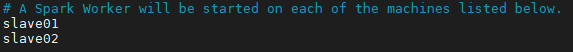(slave前不含#号)

##### 编辑spark-env.sh 文件

```cmd
cp spark-env.sh.template spark-env.sh
vim spark-env.sh
```

在首部添加如下字段

```cmd
export SPARK_DIST_CLASSPATH=$(/usr/local/hadoop/bin/hadoop classpath)
export HADOOP_CONF_DIR=/usr/local/hadoop/etc/hadoop
export SPARK_MASTER_HOST=192.168.45.60 #对于新版本SPARK_MASTER_HOST，老版本SPARK_MASTER_IP
export SPARK_MASTER_PORT=7077
```

### slave主机配置

#### 虚拟机复制

1. 虚拟机复制2份


1. 双击用VMWare打开即可识别新的虚拟机（记得给虚拟机重命名）
2. 打开，重命名这几个虚拟机（可能会发生程序被部分程序锁定，关闭所有虚拟机后再启动即可）


#### 配置从主机

##### 

##### 

##### 更改IP地址

```
sudo vi /etc/sysconfig/network-scripts/ifcfg-ens33
```

根据之前的设计

- slave01的IPADDR=192.168.45.70
- slave02的IPADDR=192.168.45.80

|                                                              |                                                              |
| ------------------------------------------------------------ | ------------------------------------------------------------ |
| 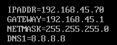 | 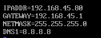 |


##### 更改主机名

```cmd
sudo vim /etc/hostname		#改变主机名（此处从主机分别为slave01，slave02）
reboot		#重启生效
```

#### SSH免密登录

自然就实现了，因为三台虚拟机~/.ssh/直接复制的，私钥公钥都是相同的，故相互都可以直接登录。

也可以直接删除原有的SSH，再生成新的加入authorized_key文件


### Hadoop集群启动

##### 

```
cd /usr/local/hadoop
bin/hdfs namenode -format #格式化命令，仅第一次启动需要
sbin/start-all.sh
```

- master主机键入jps显示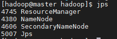
- slave01，slave02键入jps显示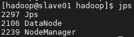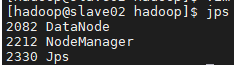

### 启动Spark集群 

1. 先启动Hadoop集群

   ```cmd
   cd /usr/local/hadoop/
   sbin/start-all.sh
   ```

2. 启动spark集群节点

   ```cmd
   cd /usr/local/spark/
   sbin/start-all.sh
   ```

   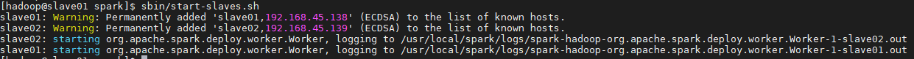

   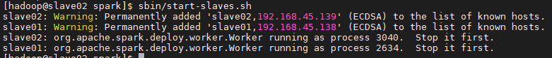

3. 用jps查看

   | master                                                       | slave01                                                      | slave02                                                      |
   | ------------------------------------------------------------ | ------------------------------------------------------------ | ------------------------------------------------------------ |
   | 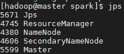 |  | 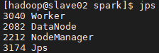 |

   

4. 用webUI查看（master主机）192.168.45.60:8080即可

   对于没有安装GNOME桌面的可以在Window的浏览器查看，若想在虚拟机上查看要安装桌面

**常见问题：**webUI其中的workers为0，可能是端口没有开放原因，开放7077端口尝试下。

`对于大部分的问题根据Spark和Hadoop的日志一步步修改即可`

