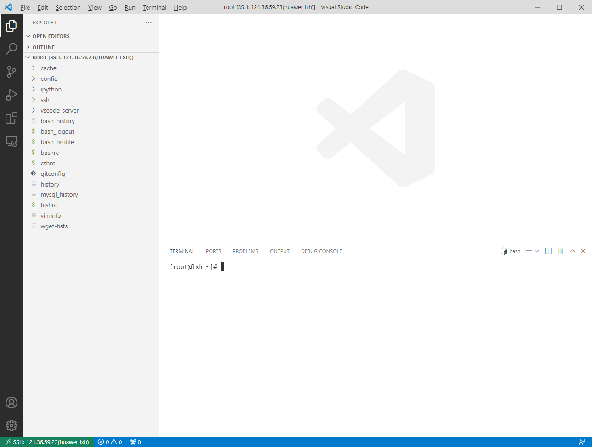

> 2本文档记录了VS Code官方插件Remote - Development系列包含的的Remote-SSH插件的使用以及延伸至对应的SSH工具的配置。
>
> ​																												            			   ————李新浩
>
> 参考：
>
> 官方文档：https://code.visualstudio.com/docs/remote/remote-overview
>
> 使用VS Code远程开发：https://python.freelycode.com/contribution/detail/1638
>
> Pycharm远程开发的配置：https://zhuanlan.zhihu.com/p/93236936

# 1 SSH简介

> **Secure Shell**（安全外壳协议，简称**SSH**）是一种加密的网络传输协议，可在不安全的网络中为网络服务提供安全的传输环境。SSH通过在网络中创建安全隧道来实现SSH客户端与服务器之间的连接。SSH最常见的用途是远程登录系统，人们通常利用SSH来传输命令行界面和远程执行命令。SSH使用频率最高的场合是类Unix系统，但是Windows操作系统也能有限度地使用SSH。2015年，微软宣布将在未来的操作系统中提供原生SSH协议支持，Windows 10 1803版本已提供OpenSSH工具。


我们可以在命令行直接使用上述命令远程连接服务器，但是这样没有图形化界面。

## 1.1 检查SSH安装情况

> 我以Ubuntu系统进行演示，其他Linux系统大同小异。

1. 首先查看当前的ubuntu是否安装了ssh-server服务。默认只安装ssh-client服务。

    ```bash
    dpkg -l | grep ssh
    ```

    

    华为的本来就是远程登录，肯定是装了的，如果没有装需要自行安装：

    ```bash
    sudo apt-get install openssh-server
    ```

2. 然后需要确认ssh-server是否启动了：

    ```bash
    ps -e | grep ssh
    ```

    

    如果看到`sshd`那说明ssh-server已经启动了。

    ssh-server配置文件位于`/etc/ssh/sshd_config`，在这里可以定义SSH的服务端口，默认端口是22，你可以自己定义成其他端口号，如222。（或把配置文件中的”PermitRootLogin without-password”加一个”#”号,把它注释掉，再增加一句”PermitRootLogin yes”**改了这个才能用密码登录root**）
    然后重启SSH服务：

    ```bash
    sudo /etc/init.d/ssh stop
    sudo /etc/init.d/ssh start
    ```
# 2 VSCode远程连接华为服务器

## 2.1 安装Remote-SSH插件

Remote-SSH是微软官方提供的vscode远程ssh登录的辅助插件：


在vscode插件扩展中搜索安装即可，安装完毕左下角应该会出现一个绿色的按钮：

## 2.2 配置Remote-SSH插件

1. 首先我们需要知道远程服务器的公网IP，即华为服务器的**弹性公网IP**。

2. 点击左下角的绿色按钮：，在弹出的窗口选择**Open SSH Configuration File...**，打开配置文件：


3. 接着选择用户目录下的vscode的Remote-ssh配置保存文件打开，在我这是选第一个。


4. 按如下格式填写远程服务器公网IP和用户名，`IdentityFile`是免密登录私钥地址，如果没有配置则每次远程登录需要输入密码：


5. 配置好文件后在左侧导航栏可以看到已经存在的远端服务器，右键选择一个进行连接：


连接成功界面如下：


## 2.3 进行远程开发

连接上后就和我们本地使用vscode没有什么区别，我们可以使用terminal进行命令行操作，也可以在vscode里面打开远端的文件夹，进行文件修改下载上传等操作：



当然也可以在远端debug和运行python代码：

> 如果没有安装python的话还需要再在远端安装python拓展（因为远端无法使用我们本地的扩展） 。
>
> 


# 3 Pycharm远程连接华为服务器

## 3.1 安装Pycharm专业版

在Pycharm中此功能需要用专业版，正版的话直接去官网学生申请即可（我们重大的邮箱没法申请，需要拍学生证申请）。

## 3.2 配置SSH Configurations

1. 打开File->Settings->SSH Configurations，进行SSH配置：


2. 输入完SSH信息后点击Test Connection验证连接状态：


3. 之后就可以在Tools打开一个SSH Session：


4. 之后就可以进行对服务器的命令行操作了：


## 3.3 进行远程开发

仅仅使用命令行是肯定不够的，pycharm提供了很多更便捷的工具：

### 3.3.1 使用远端python解释器

1. 打开project的interpreter界面，添加python解释器：


2. 选择SSH Interpreter，选择刚刚配置好的服务器：


3. 选择服务器中你需要的解释器，以及项目文件的映射路径，勾选自动同步等配置：


4. 配置完成后就和本地解释器的使用差不多了：


5. 如果需要修改映射路径可以在tools->Deployment->Configurations进行修改：


6. 可以在远端服务器查看对应的映射目录：


### 3.3.2 打开远端目录

1. 我们可以通过tools->Deployment->Configurations->Browse Remote Host打开远端目录文件树：


2. 之后就可以操作远端目录的文件：


# 4 可能出现的问题

## 4.1 远端解释器连接失败


八成是解释器路径写错了，很多系统默认装的是python3，修改解释器路径即可：


## 4.2 openEuler系统ssh连不上

> 可能是openEuler系统才会碰到这事。

可能是服务器设置问题，需要修改/etc/ssh/sshd_config文件：

1. 首先，运行如下命令

```bash
vi /etc/ssh/sshd_config
```

2. 接着，我们要做如下修改

```bash
AllowAgentForwarding yes
AllowTcpForwarding yes
GatewayPorts yes
```

3. **改完记得重启服务器**。
